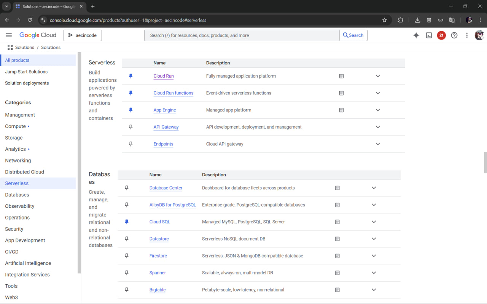
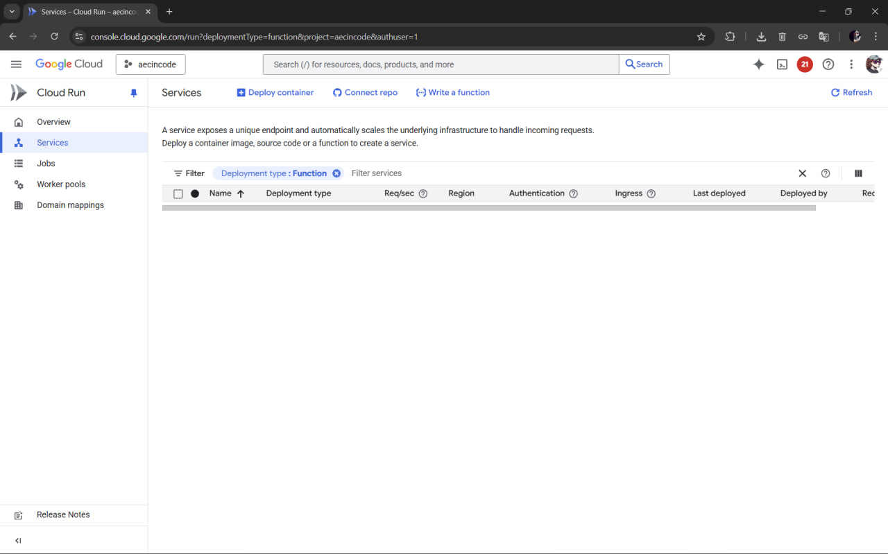

# GCP - Cloud Functions

This document explains how to create a project on [GCP](https://console.cloud.google.com/) and where to find products to deploy your backend ([Cloud Run](https://cloud.google.com/free/docs/free-cloud-features#cloud-run) and/or [Cloud Functions](https://cloud.google.com/free/docs/free-cloud-features#cloud-functions))

<!-- TABLE OF CONTENTS -->
<details>
  <summary>Table of Contents</summary>
  <ol>
    <li>
      <a href="#about">About</a>
    </li>
    <li>
      <a href="#getting-started">Getting Started</a>
        <li><a href="#prerequisites">Creating a server function</a></li>
        <li><a href="#settings">Server function settings
</a></li>
    </li>
    <li><a href="#testing">Testing the function</a></li>
    <li><a href="#resources">Resources</a></li>
  </ol>
</details>

### Getting Started

1. Create an account on [Google Cloud Platform](https://console.cloud.google.com/). \
**NOTE:** if you are using your private account and insert your card details, GCP has a [free trail]() that gives [$300 credits](https://docs.cloud.google.com/free/docs/free-cloud-features) and [free tier](https://cloud.google.com/free), which means you have a free usage of different services within certain limits. 

For [Cloud Functions](https://cloud.google.com/free/docs/free-cloud-features#cloud-functions) the limit is **2 million calls*** 🙃
1. Look at the website:
\


<p align="right">(<a href="#readme-top">back to top</a>)</p>

### Creating a server function

1. On GCP all resources should be collected under a *project* - think about it as a folder that has all the things related to one project (images, files, functions etc). Create a new project:

1. Give your project a name (e.g. ```thesis```) and choose an organization (can be ```No organization``` as well). Click on ```Create project```.
1. When the project is created you get a notification:

1. Go to the menu on the left side. There is an **extremely long** list of all the different GCP products and services. Click on ```View all products``` to expand it even more and choose ```Cloud Run```. You find it under the section ```Serverless```. You can pin this product - it will be more comfortable accessing it later.

1. In the project you have two options: 

    * deploying a container (use when you have _several endpoints_) 
    * write a function (use when you have _a single endpoint_)



**NOTE:** it will be unclickable if you don't have a payment method connected to it. You would need to link a card to it - but you should not be charged unless you go over the [free limit](https://cloud.google.com/free). For this click on ```Billing``` on the left side. \
**ANOTHER NOTE:** New users receive [$300 credits](https://docs.cloud.google.com/free/docs/free-cloud-features) to use on GCP for 3 months (which is quite a lot). You could activate them instead. 

<p align="right">(<a href="#readme-top">back to top</a>)</p>

## Deployment

You can deploy your server directly from visual code:
* [Cloud Functions](./deploy-cloud-functions.md)

_Note:_ for testing purposes you can leave unauthenticated invocations (can be called by anyone), but it is **recommended** to use authentication for protection. Make sure you control [your spending](https://console.cloud.google.com/billing/) and delete the unused resources.

### Resources

* [GCP console](https://console.cloud.google.com)
* [Free resources on GCP](https://cloud.google.com/free)
* [Cloud Functions limits](https://cloud.google.com/free/docs/free-cloud-features#cloud-functions)
* [Cloud Functions docs](https://cloud.google.com/functions/docs)
*  [Cloud Functions How-To Guides](https://cloud.google.com/functions/docs/how-to)
* [GCP tutorials - different products of GCP](https://www.cloudskillsboost.google/journeys)

<p align="right">(<a href="#readme-top">back to top</a>)</p>